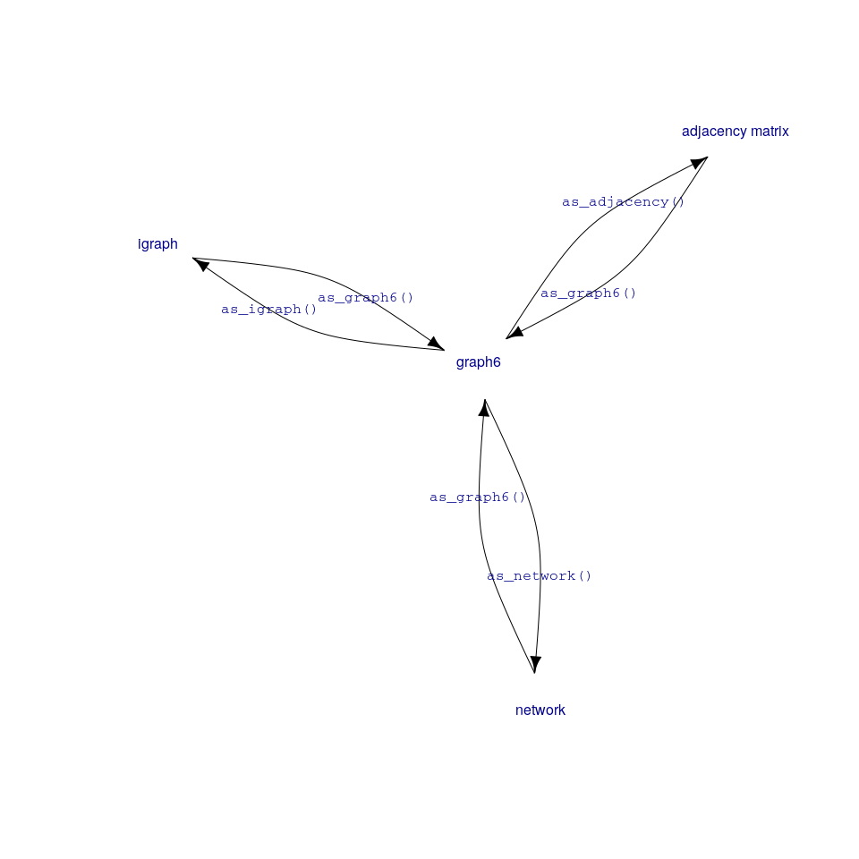

<!-- README.md is generated from README.Rmd. Please edit that file -->

# rgraph6: Representing Undirected Graphs as graph6 Strings

<!-- badges: start -->

[](https://travis-ci.org/mbojan/rgraph6)
[](https://ci.appveyor.com/project/mbojan/rgraph6)
[](http://cranlogs.r-pkg.org/)
[](https://cran.r-project.org/package=rgraph6)
<!-- badges: end -->

Functions in this package allow for converting network data (undirected
graphs of size up to 128 nodes) to compact graph6 symbols and back.
Graph6 symbols are convenient in a number of contexts, especially when
working with large number of graphs.

## What is graph6?

Graph6 is a compact format for representing undirected graphs as strings
of printable ASCII characters due to [Brendan
McKay](https://en.wikipedia.org/wiki/Brendan_McKay). See
[here](http://users.cecs.anu.edu.au/~bdm/data/formats.txt) for format
specification.

## Installation

``` r
devtools::install_github("mbojan/rgraph6", build_vignettes=TRUE)
```

## Usage

At this moment there are the following functions available:



For example:

``` r
# Some adjacency matrix
am <- structure(c(0, 0, 1, 0, 1, 0, 1, 0, 0, 0, 0, 0, 0, 0, 1, 1, 0, 
1, 0, 1, 0, 1, 1, 1, 1, 1, 0, 0, 0, 0, 1, 0, 0, 0, 1, 0, 0, 1, 
0, 0, 0, 0, 0, 0, 0, 0, 1, 0, 1, 0, 0, 0, 0, 0, 0, 0, 1, 0, 0, 
0, 0, 1, 0, 0, 0, 0, 1, 0, 0, 0, 1, 1, 1, 0, 1, 0, 0, 1, 0, 1, 
1, 0, 0, 1, 0, 1, 0, 0, 0, 0, 1, 0, 1, 1, 1, 1, 0, 0, 0, 0, 1, 
0, 1, 1, 0, 0, 0, 1, 0, 1, 0, 0, 0, 0, 0, 1, 0, 0, 0, 1, 0, 1, 
1, 1, 0, 1, 0, 1, 0, 0, 0, 1, 0, 1, 0, 0, 0, 1, 1, 1, 1, 1, 1, 
0), .Dim = c(12L, 12L))

# Corresponding graph6 symbol
(g6 <- as_graph6(am))
#> <graph6>
#> [1] "KY`DICJORiG~"

# To igraph
(ig <- as_igraph(g6)[[1]])
#> IGRAPH 82f400f U--- 12 27 -- 
#> + edges from 82f400f:
#>  [1]  1-- 3  1-- 5  1-- 7  2-- 3  2-- 4  2-- 6  2-- 8  2--10  2--11  2--12
#> [11]  3-- 7  3--11  4--11  5-- 9  6-- 7  6--11  6--12  7-- 8  7-- 9  7--12
#> [21]  8-- 9  8--10  8--11  8--12  9--12 10--12 11--12

# To network
(net <- as_network(g6)[[1]])
#>  Network attributes:
#>   vertices = 12 
#>   directed = FALSE 
#>   hyper = FALSE 
#>   loops = FALSE 
#>   multiple = FALSE 
#>   bipartite = FALSE 
#>   total edges= 27 
#>     missing edges= 0 
#>     non-missing edges= 27 
#> 
#>  Vertex attribute names: 
#>     vertex.names 
#> 
#> No edge attributes

# Back to adjacency matrix
am2 <- as_adjacency(g6)[[1]]

identical(am, am2)
#> [1] TRUE
```

### Tidy graph databases

The graph6 format shines if we need to store large number of graphs in a
data frame. Let’s generate a list of random graphs as igraph objects and
store them in a data frame column of graph6 symbols:

``` r
library("dplyr")
#> 
#> Attaching package: 'dplyr'
#> The following objects are masked from 'package:stats':
#> 
#>     filter, lag
#> The following objects are masked from 'package:base':
#> 
#>     intersect, setdiff, setequal, union

# Generate list of igraph objects
set.seed(666)

d <- tibble::tibble(
  g6 = replicate(
    10,
    igraph::random.graph.game(sample(3:12, replace=TRUE), p=.5, directed=FALSE),
    simplify=FALSE
  ) %>%
    as_graph6()
)
d
#> # A tibble: 10 x 1
#>    g6            
#>    <chr>         
#>  1 "FblF_"       
#>  2 "DFc"         
#>  3 "HfTaMwk"     
#>  4 "KefToktrftZ~"
#>  5 "JPraDzZQ?M?" 
#>  6 "Bo"          
#>  7 "Ed`w"        
#>  8 "Gpuq|{"      
#>  9 "EbSG"        
#> 10 "ICNa@Gg\\o"
```

Nice and compact. Now we can do some computations and save the results
together with graph data to a simple CSV file:

``` r
d %>%
  dplyr::mutate(
    igraphs = as_igraph(g6),
    vc = purrr::map_dbl(igraphs, igraph::vcount),
    ec = purrr::map_dbl(igraphs, igraph::ecount),
    density = purrr::map_dbl(igraphs, igraph::edge_density)
  ) %>%
  dplyr::select(-igraphs) %>%
  write.csv(row.names = FALSE)
#> "g6","vc","ec","density"
#> "FblF_",7,11,0.523809523809524
#> "DFc",5,5,0.5
#> "HfTaMwk",9,18,0.5
#> "KefToktrftZ~",12,41,0.621212121212121
#> "JPraDzZQ?M?",11,24,0.436363636363636
#> "Bo",3,2,0.666666666666667
#> "Ed`w",6,8,0.533333333333333
#> "Gpuq|{",8,19,0.678571428571429
#> "EbSG",6,6,0.4
#> "ICNa@Gg\o",10,17,0.377777777777778
```
