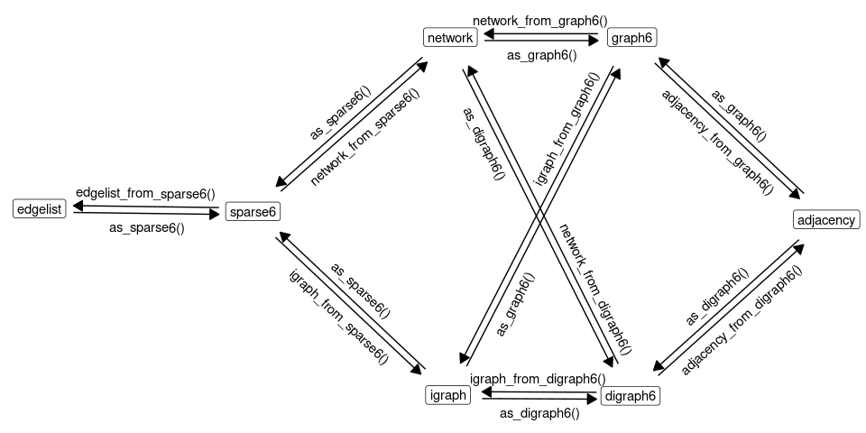

```{r setup, include = FALSE}
library(rgraph6)
requireNamespace("igraph")
requireNamespace("knitr")

knitr::opts_chunk$set(
  collapse = TRUE
  # comment = "#>"
)
```


## The formats

Let's generate an example directed and undirected graphs:

```{r, fig.width=5, fig.height=5}
set.seed(123)
g_directed <- igraph::sample_gnm(12, 12, directed=TRUE)
g_undirected <- igraph::as.undirected(g_directed)
igraph::igraph_options(vertex.color="white", vertex.label.color="black",
                       edge.color="black", edge.arrow.size=0.5)
plot(g_directed)
plot(g_undirected)
```


### Digraph6

The 'digraph6' is designed for directed graphs. Encoding `g_directed` will give:

```{r}
as_digraph6(g_directed)
```


### Graph6

The 'graph6' format is designed for undirected graphs. It is more efficient for *dense* graphs. Encoding `g_undirected` will give:

```{r}
as_graph6(g_undirected)
```


### Sparse6

The 'sparse6' format is designed for undirected graphs. It is more efficient for *sparse* graphs. Encoding `g_undirected` will give:

```{r}
as_sparse6(g_undirected)
```


## Main functions

Main functions for encoding network data are:

- `graph_as_text()`
- `as_graph6()`
- `as_sparse6()`
- `as_digraph6()`

Main functions for decoding are:

- `adjacency_from_text()`
- `edgelist_from_text()`
- `igraph_from_text()`
- `network_from_text()`

Implemented functions are shown on the following graph:

{ width="100%" }


## Examples

### Encode a list of 'igraph' objects

Generate a list of igraph objects:

```{r}
set.seed(666)
igraph_list <- replicate(5, igraph::sample_gnp(10, 0.1, directed=FALSE), 
                         simplify = FALSE)
```

Encode as 'graph6' symbols:

```{r}
as_graph6(igraph_list)
```

Encode as 'sparse6' symbols:

```{r}
as_sparse6(igraph_list)
```


### Decode a vector of different types of symbols

Using example data `g6`, `d6`, and `s6` provided with the package:

```{r example-mixed}
# Create a vector with a mixture of 'graph6', 'digraph6' and 'sparse6' symbols
x <- c(g6[1], s6[2], d6[3])
x

# Parse to igraph objects (package igraph required)
igraph_from_text(x)

# Parse to network objects (package network required)
network_from_text(x)
```


### Tidy graph databases

The formats shine if we need to store large number of graphs in a data frame. Let's generate a list of random graphs as igraph objects and store them in a data frame column of graph6 symbols:

```{r}
# Generate list of igraph objects
set.seed(666)

d <- data.frame(
  g6 = as_graph6(replicate(
    10,
    igraph::random.graph.game(sample(3:12, replace=TRUE), p=.5, directed=FALSE),
    simplify=FALSE
  ))
)
d
```

Nice and compact. We can go further by doing some computations and saving the results together with the graph data:

```{r}
d2 <- within(
  d, {
    igraphs <- igraph_from_text(g6)
    vc <- vapply(igraphs, igraph::vcount, integer(1))
    ec <- vapply(igraphs, igraph::ecount, numeric(1))
    density <- vapply(igraphs, igraph::edge_density, numeric(1))
})
d2$igraphs <- NULL
str(d2, 1)
```

... and even save it to a simple CSV file!

```{r}
write.csv(d2, row.names = FALSE)
```
